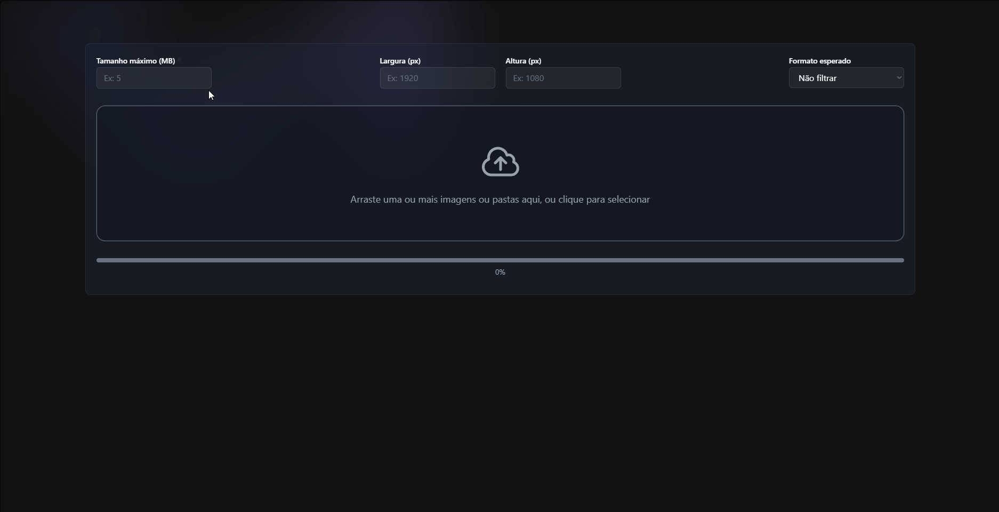

<div align="center">
  
  
  <h2><strong>ValidAi</strong></h2>
  <p><strong>Image validation pipeline</strong></p>


</div>

---

## 🎬 Demo

### Upload and Validation Flow



---

## 🎯 Why

In production environments, image collections are often published without proper validation.  
This can lead to:

- Layout inconsistencies  
- Incorrect dimensions  
- Unsupported formats  
- Operational overhead between teams  

**ValidAi ensures image compliance before deployment**, providing reports and clear feedback.

> Ensuring format, size and dimension compliance before publication.

---

## ✨ Features

- Multi-file upload
- Client-side format validation
- Backend image validation (size, dimensions, format)
- Detailed validation report per file
- Filtering by custom parameters (dimensions, size and format)
- Clear approved / failed breakdown

---

## 🔎 How It Works

1. The user uploads one or multiple files.
2. The frontend validates file format (basic filtering).
3. Valid files are sent to the backend.
4. The backend validates:
   - Image format
   - File size
   - Image dimensions
5. A structured validation report is returned.
6. Results are displayed with approval status and detailed checks.

---

## 🏗️ Architecture

**Frontend**
- React (Vite)
- TailwindCSS
- React Dropzone

**Backend**
- FastAPI
- Pillow (image processing)
- Python

The frontend handles UX and basic validation.  
The backend performs authoritative validation and returns structured results.

---

## 🚀 Installing ValidAi

To install `ValidAi`, follow these steps:

### 1️⃣ Clone the repository

```bash
git clone https://github.com/gabrielbelloo/ValidAi
cd ValidAi
```

### 2️⃣ Backend Setup

```bash
cd server
python -m venv venv
```
Windows:

```bash
.\venv\Scripts\Activate.ps1
```
MacOS / Linux:
```bash
source venv/bin/activate
```

```bash
pip install -r requirements.txt
uvicorn app.main:app --reload
```
Backend will run at:
```bash
http://localhost:8000
```

### 3️⃣ Frontend Setup

Open a new terminal
```bash
cd client
npm install
npm run dev
```
Frontend will run at:
```bash
http://localhost:5173
```

---

## 📦 Example API Response

```json
{
  "results": [
    {
      "filename": "5001 97 00663#0.jpg",
      "approved": false,
      "stage": "validation",
      "summary": "Falha na validação da imagem",
      "file_url": "/uploads/5001_97_00663_0.jpg",
      "checks": [
        {
          "name": "Tamanho",
          "value": "16.60 mb",
          "status": "error",
          "errors": [
            {
              "code": "file_too_large",
              "message": "O tamanho do arquivo excede o limite de 10 mb."
            }
          ]
        },
        {
          "name": "Dimensões",
          "value": "3890x5834",
          "status": "error",
          "errors": [
            {
              "code": "invalid_dimensions",
              "message": "As dimensões da imagem devem ser 1024x768 pixels."
            }
          ]
        },
        {
          "name": "Nomenclatura",
          "value": "5001 97 00663#0.jpg",
          "status": "ok",
          "errors": null
        }
      ]
    }
  ]
}
```

---

## 🧩 Use Cases

- E-commerce product collections
- Marketing campaign launches
- FTP-based image publishing workflows
- Bulk media validation before release


---

## 🛣️ Updates and Improvements

The project is still under development, and upcoming updates will focus on the following tasks:

- [ ] Parallel upload (concurrent processing)
- [ ] Per-file progress tracking
- [ ] Result sorting (status, filename, date)
- [ ] Filename search

---

## 🤝 Contributing
Contributions are welcome.

1. Fork this repository.
2. Create a  new branch:
```bash
git checkout -b feature/your-feature-name
```
3. Commit your changes:
```bash
git commit -m "feat: add your feature"
```
4. Push to your branch:
```bash
git push origin feature/your-feature-name
```
5. Open a pull request.

Alternatively, refer to the GitHub documentation on [how to create a pull request](https://help.github.com/en/github/collaborating-with-issues-and-pull-requests/creating-a-pull-request).

## 📄 License
This project is open-source and available under the MIT License.

